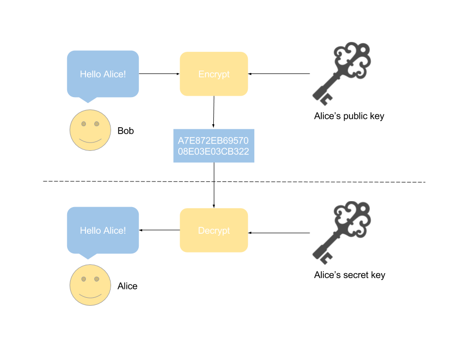

I recommend [ed25519](https://github.com/eiminsasete/github-sample/blob/master/connect-with/ed25519.md).

# SSH key

SSH keys serve as a means of identifying yourself to an SSH server using public-key cryptography and challenge-response authentication.

## Types of keys

- DSA（Old, short key length）
- RSA（95% of Github users）
- ECDSA（Elliptic Curve DSA. Fewer bits than RSA and Higher encryption strength）
- ED25519（Elliptic Curve Cryptography. Faster than ECDSA.）

## challenge-response authentication

An authentication method that prevents eavesdropping of passwords during communication by applying special processing to the character string.

## public-key cryptography

